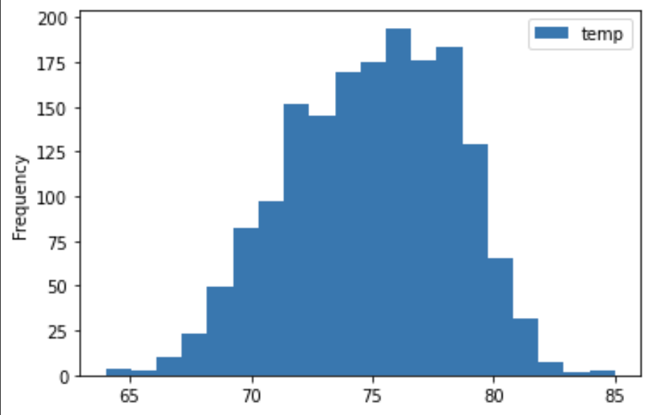

# Surf's Up with Advanced Data Storage and Retrieval

## Overview

The purpose of this project is to analyze a weather data set in support of the setup of an imaginary Surf and Shake shop in Hawaii. The focused months for the weather data are June and December.

---

## Results

1. The screenshot on the left represents the summary statistics of the temperatures in June, while the screenshot on the right represents that in December.
    

        
        
    

    What's clear and expected is that Hawaii is in general hotter in June than in December by ~5.2%.

 

2. The below screenshot shows the distribution of temperatures in June.
    

        
    
 

    As we can see, the temperature's fairly consistent along the month. This indicates that the weather will be predictable and we can rely on it to maintain a constant supply of our cold beverages.

 

3. The below screenshot shows the distribution of temperatures in December.
    

        
    

    The temperatures in December are fairly varying along the month. It is a month when we project a slightly weaker business given that the erratic weather would turn off surfers from visiting the beach more often.

---

## Summary

A snapshot of our analysis is that June is a more safe and favorable month for business than December. However, December is still a very viable time for business. The mean temperature is merely 4 degrees colder in December and the high frequency temperature ranges overlap with those in June.

Two areas that may be worth querying would be precipitation and wind speed as they will have heavy bearing on surfing parameters. It could give us a more relevant look at weather data. Lastly, I would also recommend looking at data from months of other seasons such as spring and autumn, to see if there's a meaningful difference in temperature and the above mentioned parameters. 